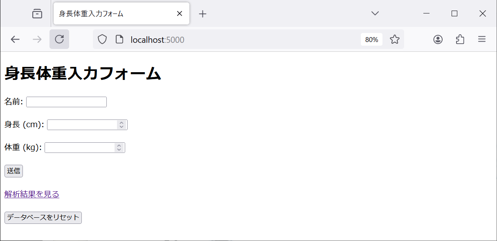
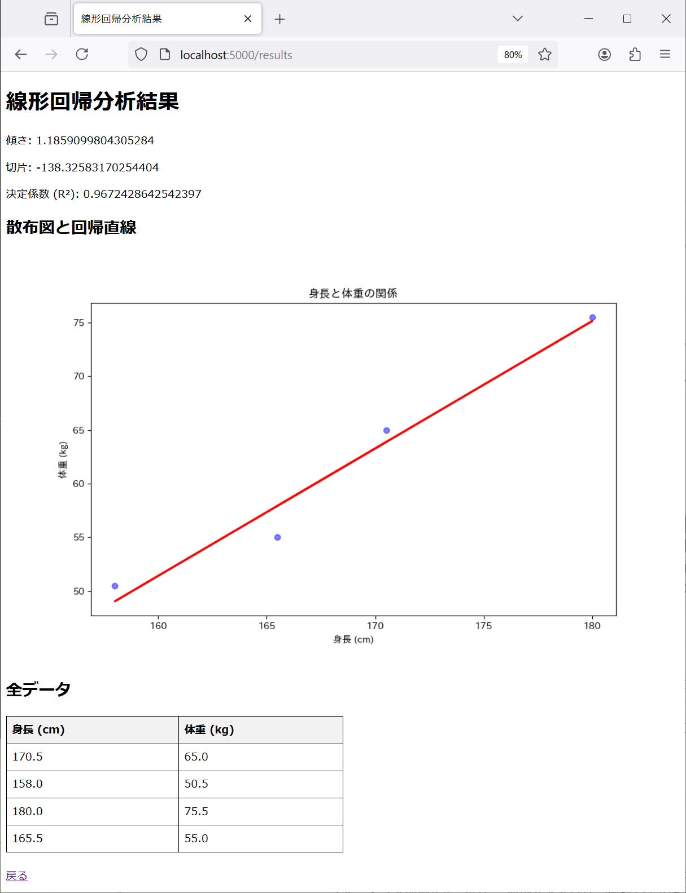

# データ収集フォーム＋解析アプリの例

## 概要

データの収集と解析を行うウェブアプリの例である．

次の二つの要素で構成される．

1. 名前・身長・体重のデータを収集するためのフォーム
1. (身長, 体重)の散布図と，それにフィットする直線を表示するウェブページ





## 実行に必要なもの

### git

動作確認：次が実行できることを確認する．

```bash
git clone https://github.com/taroyabuki/ex-data-sci-app.git
```

### Docker

動作確認：次が実行できることを確認する．

```bash
docker run --rm curlimages/curl curl -s http://example.net
```

## 実行方法

gitの動作確認でリポジトリを取得した後で，次のコマンドを実行する．

```bash
cd ex-data-sci-app
docker-compose up
```

Ctrl-cで終了する．

## 作成手順

Claudeを使って作成した．

使用したプロンプトを示す．

```
Pythonで次のようなウェブアプリを作りたい．
・名前・身長・体重を入力するウェブフォームを作る．
・フォームで入力されたデータを集めて，線形回帰分析を行い，結果をウェブページに表示する．
Dockerを使う完全な方法を示して．
```

上のプロンプトで生成されたアプリは，データを永続化しないものであった（実行はしていない）．

そこで，プロンプトを次のように変更した．

```
Pythonで次のようなウェブアプリを作りたい．
・名前・身長・体重を入力するウェブフォームを作る．
・フォームで入力されたデータをSQLiteのデータベースに格納する．
・データベースのデータで線形回帰分析を行い，結果をウェブページに表示する．
Dockerを使う完全な方法を示して．
```

上のプロンプトで生成されたアプリは，結果の可視化をしないものであった（実行はしていない）．

```
結果には，散布図と回帰直線を表示して
```

```
サンプルデータを4人分入れておいて．身長はcm，体重はkgで
```

上のプロンプトで生成されたアプリは，`docker-compose up --build`でエラーが発生するものであった．

そこで，表示されたエラーメッセージをプロンプトとして与えたら，requirements.txtの修正案が生成された．

Claudeの指示に従ってビルドし直したところ，完全に動作した．

実行してみると，足りない機能や不備があったため，次のプロンプトを与えた．

```
次の修正をしてください．
・トップページから，データを入力せずに，解析結果のページに遷移できるようにする．
・解析結果のページで，グラフの後に，全データを表形式で表示する．
・グラフの画像の文字化けを解消する．
```

生成されたアプリは完全に動作した．

実行してみると，足りない機能があったため，次のプロンプトを与えた．

```
データベースをリセットして，サンプルデータ（4人分）に戻すためのボタンを，トップページに追加してください．
```

このリポジトリにあるアプリは，以上によって生成されたものである．
